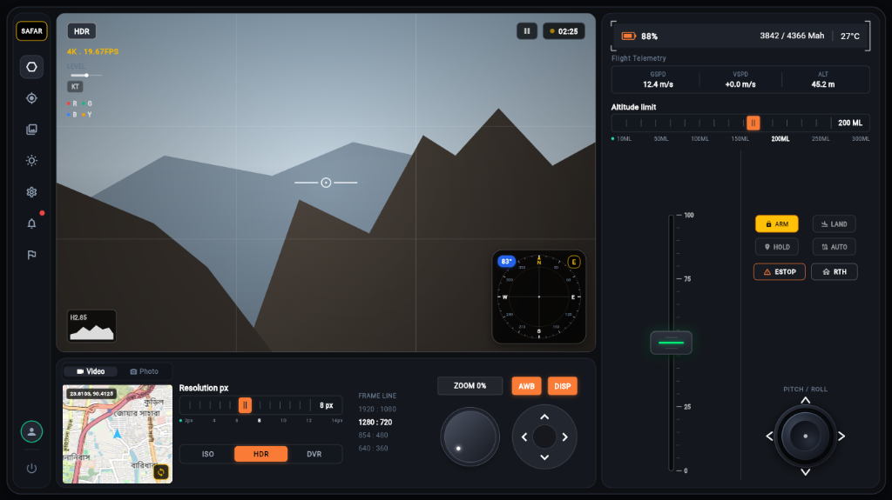
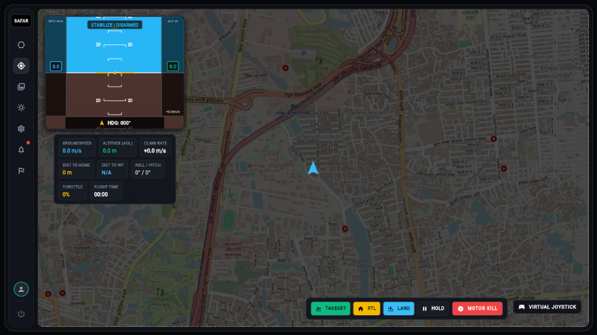
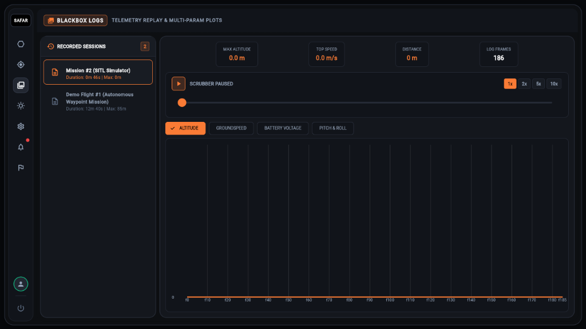
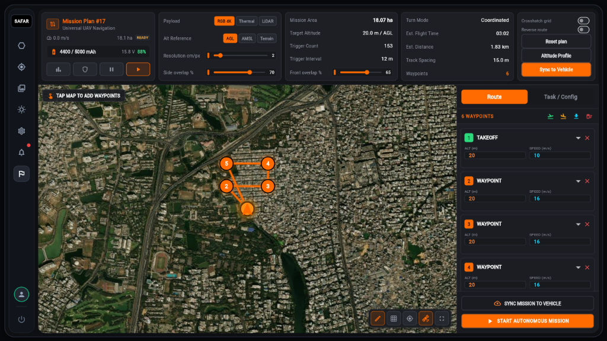
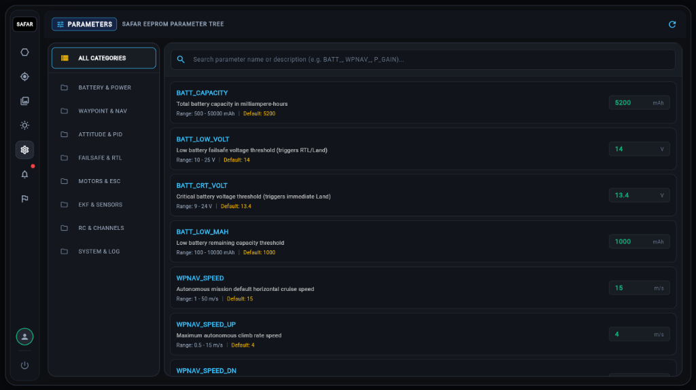
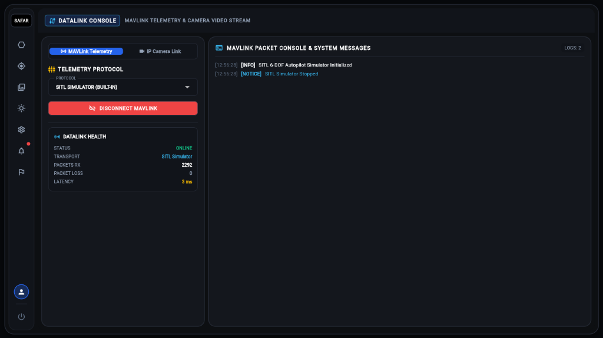
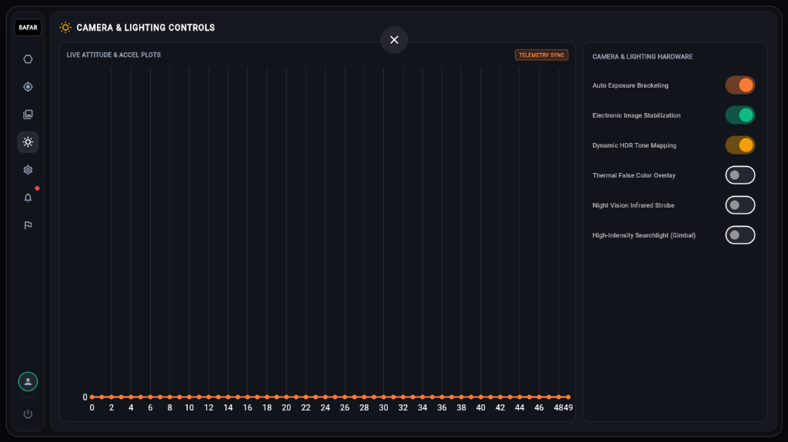
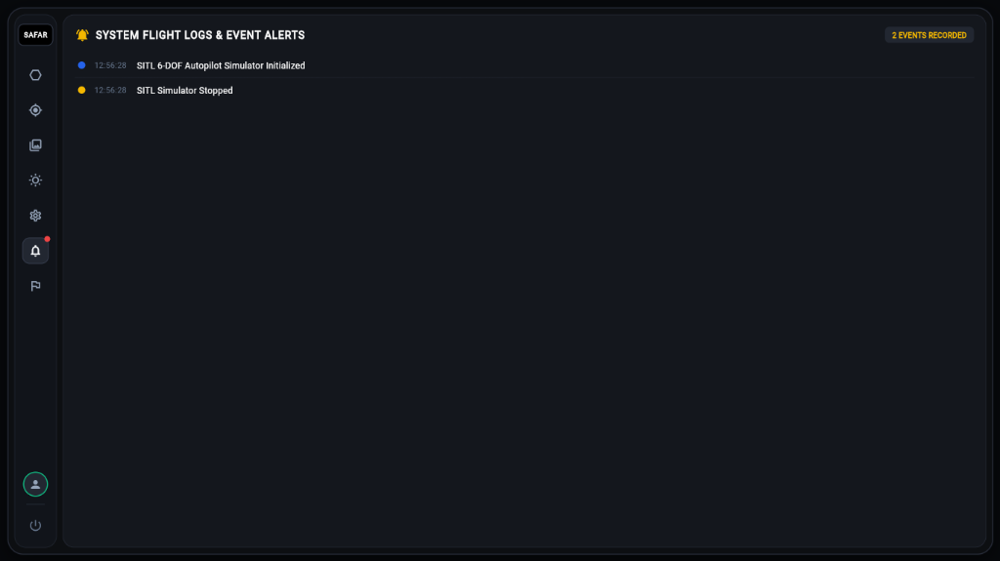

<div align="center">

# 🛰️ SAFAR Ground Control Station (GCS)
### Advanced Aerospace Telemetry, Cockpit & Autonomous Mission Controller

[](https://flutter.dev)
[](https://github.com/sajidsam/subRocket/releases)
[](https://flutter.dev/web)
[](https://mavlink.io)
[](https://github.com/sajidsam/subRocket/releases)

<br/>

**SAFAR GCS** is a tactical, high-performance Ground Control Station engineered for autonomous UAVs, rockets, and submersibles. Built with Flutter, it provides a comprehensive tactical cockpit interface with low-latency telemetry streaming, dual-viewport camera/satellite overlays, autonomous waypoint planning, blackbox session replays, and live EEPROM parameter calibration.

<br/>



</div>

---

## ⚡ Core Capabilities

- 🎮 **Tactical Cockpit & Flight Deck:** Dual-viewport camera viewfinder with live compass HUD, altitude ceiling limits, multi-resolution sensor settings, analog throttle slider, and virtual joystick controls.
- 🎯 **Target Tracking & Primary Flight Display (PFD):** Glassmorphic artificial horizon HUD overlay with groundspeed, altitude (AGL), climb rate, distance to home/waypoint, and real-time roll/pitch indicators.
- 🗺️ **Autonomous Mission Planner:** Waypoint survey planning on high-resolution satellite imagery with payload selection (RGB 4K, Thermal, LiDAR), AGL/AMSL altitude reference, and dynamic geofencing.
- 📼 **Blackbox Logs & Telemetry Replay:** Recorded flight session logs with interactive variable-speed scrubbers (1x, 2x, 5x, 10x) for post-flight analysis across Altitude, Groundspeed, Battery Voltage, and Pitch/Roll.
- 📡 **Datalink & MAVLink Stream:** Built-in SITL 6-DOF simulation engine, serial/UDP link health monitor (latency, packet loss, RX packets), and live packet console.
- ⚙️ **EEPROM Parameter Tree:** Searchable registry for on-the-fly vehicle firmware register editing with safety bounds and default reset triggers.
- 💡 **Camera & Sensor Hardware Deck:** Real-time attitude and acceleration plots paired with hardware toggles for EIS, HDR tone mapping, thermal false-color, and IR strobes.
- 📋 **System Diagnostics & Flight Alerts:** Severity-graded event stream (Info, Notice, Warning, Critical) for flight safety auditing.

---

## 📸 Complete Interface Showcase

### 1. 🎛️ Primary Cockpit Dashboard
The central flight control hub featuring camera viewfinder, tactical compass HUD, flight telemetry status (GSPD, VSPD, ALT, Battery 88%), altitude limiter, flight mode triggers (`ARM`, `LAND`, `HOLD`, `AUTO`, `ESTOP`, `RTH`), and tactile throttle/joystick inputs.


---

### 2. 🎯 Tactical Target Tracking & Primary Flight Display (PFD)
Full-screen geospatial mapping with an integrated avionics HUD artificial horizon, dynamic heading tape, and comprehensive telemetry metrics.



---

### 3. 📼 Blackbox Logs & Flight Telemetry Replay
Replay historical flight telemetry missions with scrubber controls, speed multipliers (1x–10x), and synchronized multi-parametric graphs.



---

### 4. 🗺️ Autonomous Waypoint & Survey Mission Planner
Construct autonomous flight paths with custom waypoint altitudes, speeds, crosshatch survey patterns, and sensor payload profiles.



---

### 5. ⚙️ Live EEPROM Parameter Editor
Hierarchical parameter tree covering Battery & Power, Waypoint Navigation, Attitude & PID, Failsafes, Motor ESCs, and Sensors.



---

### 6. 📡 Datalink Console & MAVLink Stream
Select communication protocols (SITL Simulator, Serial COM, UDP), inspect link health (latency, packet loss), and view raw MAVLink packet logs.



---

### 7. 💡 Camera & Lighting Control Deck
Live attitude and acceleration telemetry plots paired with camera sensor toggles and gimbal illumination controls.



---

### 8. 📋 System Flight Logs & Event Alerts
Chronological audit stream with color-coded severity badges for pre-flight checklists and event tracking.



---

## 🕹️ Keyboard Controls & Safety Shortcuts

| Shortcut | Function | Description |
| :--- | :--- | :--- |
| <kbd>Space</kbd> | **Emergency Motor Kill** | Immediate motor cut-off in critical failsafe situations |
| <kbd>W</kbd> / <kbd>↑</kbd> | **Throttle Up** | Increment vehicle throttle (+5%) |
| <kbd>S</kbd> / <kbd>↓</kbd> | **Throttle Down** | Decrement vehicle throttle (-5%) |
| <kbd>A</kbd> / <kbd>←</kbd> | **Roll Left** | Tactical roll trim adjustment |
| <kbd>D</kbd> / <kbd>→</kbd> | **Roll Right** | Tactical roll trim adjustment |

---

## 📥 Download Standalone Windows Release (.exe)

Portable 64-bit Windows executables are compiled and packaged automatically on every release:

1. Navigate to the **[GitHub Releases](https://github.com/sajidsam/subRocket/releases)** page.
2. Download the latest **`SAFAR_GCS_vX.X.X_Windows_x64.zip`**.
3. Extract the ZIP archive and launch `rocket_controller.exe`.

---

## 🛠️ Development & Local Build

### Prerequisites
- [Flutter SDK](https://docs.flutter.dev/get-started/install) (3.10+)
- [Git](https://git-scm.com/)

### 1. Clone & Setup
```bash
git clone https://github.com/sajidsam/subRocket.git
cd subRocket
flutter pub get
```

### 2. Run in Development Mode
```bash
# Run on Windows Desktop
flutter run -d windows

# Run in Web Browser
flutter run -d chrome
```

### 3. Build Production Executable
```bash
# Build standalone Windows 64-bit release
flutter build windows --release

# Or package portable release ZIP with the bundled script:
.\scripts\build_release_zip.ps1
```

The output files will be in: `build/windows/x64/runner/Release/`

---

## 🏛️ System Architecture

```
lib/
├── core/
│   ├── models/            # VehicleState, ParameterItem, FlightMode, LogEntry
│   ├── presentation/      # Tactical theme, HUD PFD, Status & Emergency panels
│   └── services/          # MavlinkService, ParameterService, FlightLoggerService
└── features/
    ├── dashboard/         # Cockpit viewfinder, tactical compass, drone status cards
    ├── mission_planner/   # Waypoint route planning, geofencing & payload configs
    ├── parameters/        # EEPROM parameter tree and live editor
    ├── datalink/          # Telemetry protocol selection & MAVLink packet console
    ├── calibration/       # Sensor calibration wizards (Compass, Gyro, Accel)
    ├── flight_logs/       # Blackbox flight session logger and event audits
    └── telemetry/         # High-frequency attitude, battery, and signal charts
```

---

## 📄 License

This project is open-source and distributed under the **MIT License**.
