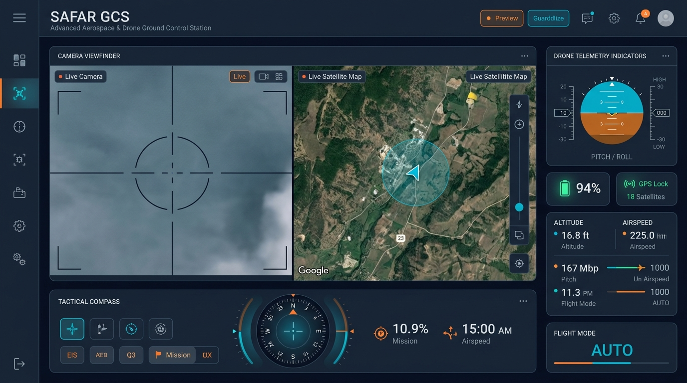
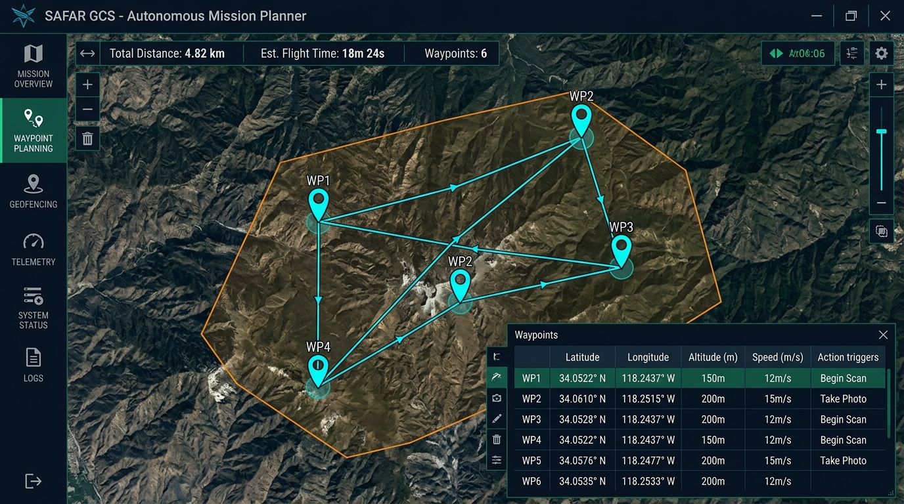
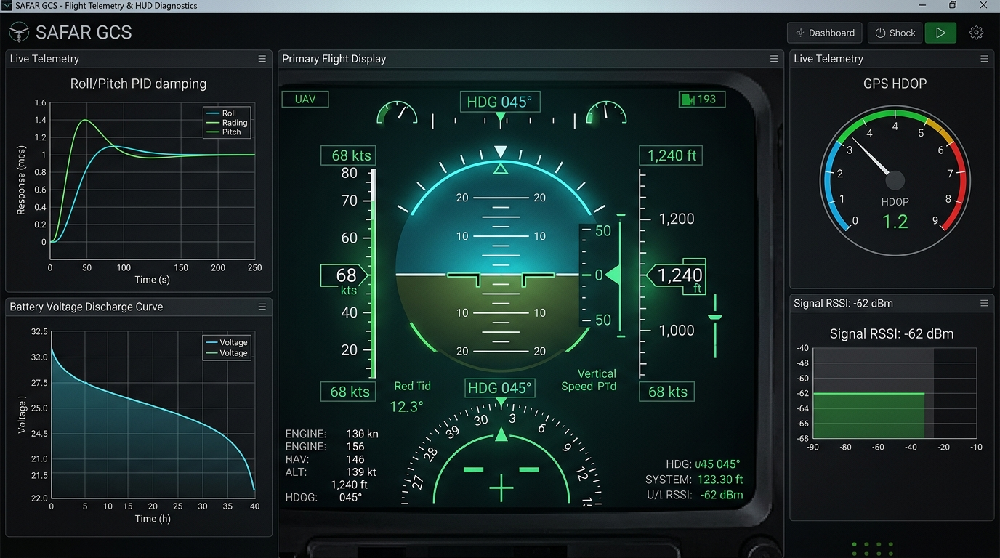

<div align="center">

# 🛰️ SAFAR Ground Control Station (GCS)
### Next-Generation Tactical Telemetry, Cockpit & Autonomous Mission Controller

[](https://flutter.dev)
[](https://github.com/sajidsam/subRocket/releases)
[](https://flutter.dev/web)
[](https://mavlink.io)
[](https://github.com/sajidsam/subRocket/releases)

<br/>

**SAFAR GCS** is a high-performance, military-grade Ground Control Station engineered for UAVs, rockets, submersibles, and autonomous aerospace vehicles. Built on Flutter and Dart, it provides a high-density, real-time tactical cockpit interface with low-latency telemetry streaming, dual-viewport camera/satellite overlays, autonomous waypoint planning, and sub-second flight parameter tuning.

<br/>



</div>

---

## ⚡ Core Highlights

- **Dynamic Dual-Zone Cockpit:** Instant one-click swapping between the optical camera viewfinder feed and tactical satellite tracking maps.
- **Avionics HUD & Primary Flight Display (PFD):** Glassmorphic artificial horizon, pitch ladder, roll bank indicators, airspeed, heading tape, and vertical speed meters.
- **Autonomous Mission Planner:** Multi-waypoint route generator with polygon geofence enforcement, altitude profile constraints, and real-time loiter commands.
- **Live Telemetry & Diagnostics:** High-frequency real-time graphing for attitude damping (PID), battery discharge degradation, GPS HDOP, and RF signal strength (RSSI).
- **On-Board Parameter Management:** Live read/write calibration of vehicle firmware registers with validation safety checks.
- **Hardware-Level Safety & Emergency Controls:** Instant emergency motor killswitch, Return-to-Launch (RTL), and tactile keyboard override bindings.

---

## 📸 System Showcase

<div align="center">

### 🗺️ Autonomous Waypoint & Geofence Planning

*Visual route construction with dynamic waypoint parameters, speed corridors, and altitude constraints.*

<br/>

### 📊 Tactical Avionics & Live Telemetry Diagnostics

*Real-time flight instrumentation, PID response curves, and battery telemetry sync.*

</div>

---

## 🕹️ Cockpit Keyboard Shortcuts

For rapid tactical response during flight operations, SAFAR GCS includes direct keyboard bindings:

| Hotkey | Action | Operational Description |
| :--- | :--- | :--- |
| <kbd>Space</kbd> | **Emergency Motor Kill** | Immediate motor cut-off in critical emergencies |
| <kbd>W</kbd> / <kbd>↑</kbd> | **Increase Throttle** | Increment vehicle throttle by +5% |
| <kbd>S</kbd> / <kbd>↓</kbd> | **Decrease Throttle** | Decrement vehicle throttle by -5% |
| <kbd>A</kbd> / <kbd>←</kbd> | **Roll Left** | Tactical roll trim adjustment |
| <kbd>D</kbd> / <kbd>→</kbd> | **Roll Right** | Tactical roll trim adjustment |

---

## 📥 Download Pre-Built Executables

Pre-compiled, standalone 64-bit Windows releases are packaged automatically with each update.

1. Navigate to the **[GitHub Releases](https://github.com/sajidsam/subRocket/releases)** page.
2. Download the latest **`SAFAR_GCS_vX.X.X_Windows_x64.zip`**.
3. Extract the archive anywhere on your machine and double-click `rocket_controller.exe` to run.

---

## 🛠️ Building & Running from Source

### Prerequisites
- [Flutter SDK](https://docs.flutter.dev/get-started/install) (3.10+ recommended)
- [Git](https://git-scm.com/)

### 1. Clone & Install Dependencies
```bash
git clone https://github.com/sajidsam/subRocket.git
cd subRocket
flutter pub get
```

### 2. Run in Development Mode
```bash
# Run on Windows Desktop
flutter run -d windows

# Run in Browser / Web
flutter run -d chrome
```

### 3. Build Production Executable
```bash
# Build standalone Windows x64 release
flutter build windows --release

# Or package portable ZIP with the bundled helper script:
.\scripts\build_release_zip.ps1
```

The generated executable will be output to:
`build/windows/x64/runner/Release/`

---

## 🏗️ Architecture & Technology Stack

| Layer | Technologies / Libraries | Functionality |
| :--- | :--- | :--- |
| **Framework** | Flutter 3.x / Dart | Cross-platform UI engine & rendering pipeline |
| **State Management** | `provider` | Reactive state propagation across avionics panels |
| **Mapping Engine** | `flutter_map`, `latlong2` | High-resolution satellite tiles, GPS tracking & geofencing |
| **Telemetry Charts** | `fl_chart` | Real-time PID damping & battery discharge curves |
| **Telemetry Protocol** | Custom MAVLink & Serial Bridge | Bidirectional communications with flight controller |
| **Persistence** | `hive`, `hive_flutter` | High-speed local caching for logs & configuration parameters |
| **Automation** | GitHub Actions CI/CD | Headless cloud compilation & automatic Windows release packaging |

---

## 📄 License & Attribution

Distributed under the **MIT License**. Engineered for aerospace research, UAV ground operations, and autonomous vehicle tracking.
